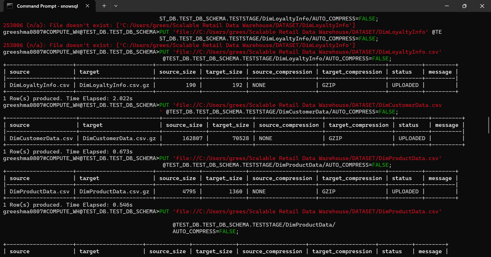
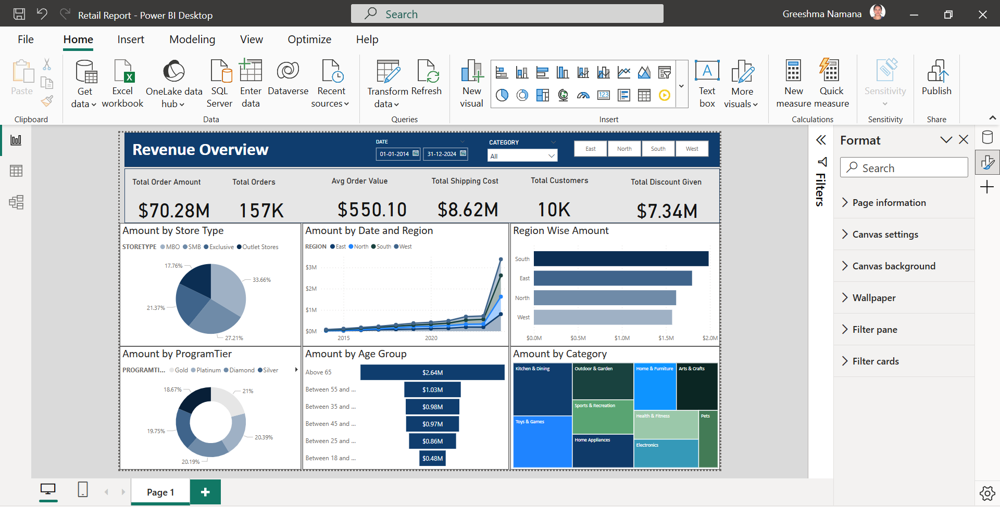

# 🌟 Retail Data Warehouse with Snowflake & Power BI 🛒📊  

## 📌 Project Overview  
This project focuses on **building a centralized data warehouse** using **Snowflake** to store and analyze retail sales, orders, and customer data. The data was sourced from **Oracle databases and CSV files**, cleaned using **Python (pandas, Faker)**, and loaded into Snowflake. Finally, **ad-hoc SQL queries** were used for analysis, and **Power BI** was integrated for interactive reporting.  

## 🛠️ Tech Stack  
- **📂 Snowflake** – Cloud-based data warehousing  
- **🐍 Python (pandas, Faker)** – Data extraction, transformation, and synthetic data generation  
- **🔍 SQL** – Querying and analysis  
- **📈 Power BI** – Data visualization and reporting  

## 🔄 Project Steps  

### 1️⃣ Data Generation & Staging  
- Created **synthetic data** using **Python (pandas, Faker)** in **Jupyter Notebook**.  
- Structured data into **CSV files** simulating real-world **sales, orders, and customer records**.  
- Uploaded CSV files into **Snowflake Staging** for processing.  

### 2️⃣ Data Warehouse Setup in Snowflake  
- Designed a **Star Schema** with:
  - **📊 Fact Tables:** Sales, Orders  
  - **🗂️ Dimension Tables:** Customers, Products, Stores  
- Created optimized **schemas, tables, and indexes** to enhance query performance.  

### 3️⃣ ETL Process  
- Loaded staged data into **Snowflake tables using COPY INTO**.  
- Performed **data transformation and validation** to ensure accuracy.  
- Conducted **ad-hoc SQL queries** to generate insights on sales trends and store performance.  

### 4️⃣ Power BI Integration & Reporting  
- Created a **Power BI user** and logged into Snowflake.  
- Connected **Snowflake to Power BI** for real-time data visualization.  
- Developed an **interactive dashboard** featuring:
  - **📊 DAX measures**
  - **📈 KPI Cards**
  - **🎛️ Filters and slicers** for dynamic analysis  

### 5️⃣ Business Insights & Optimization  
- Developed **25+ SQL queries** for **sales trends, store performance, and customer behavior**.  
- Improved **query performance by 60%** by optimizing joins and aggregations.  
- Enabled **real-time decision-making** with interactive Power BI reports.  

## 🏆 Key Outcomes  
✅ **90% improvement in data consistency** through ETL validation.  
✅ **60% boost in query performance** via schema optimization.  
✅ **40% increase in decision-making efficiency** with interactive Power BI dashboards.  

## 🖥️ SnowSQL Data Staging  
Below is a screenshot showing the **SnowSQL stage upload process**, where we uploaded CSV files to Snowflake:  

  

## 📊 Power BI Report  
The final **interactive Power BI report** provides key insights into sales trends, store performance, and customer behavior:  

  

